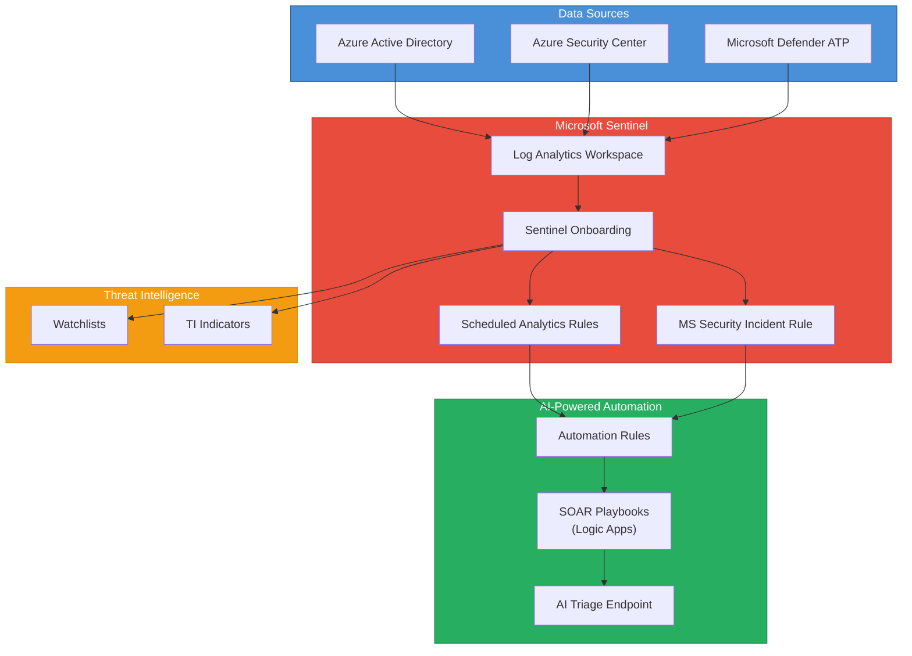

# terraform-azure-sentinel-ai

Terraform module for deploying Azure Sentinel (Microsoft Sentinel) with AI-powered SOC automation, scheduled analytics rules, SOAR playbooks, and threat intelligence integration.

## Architecture



## Documentation

- [Microsoft Sentinel Overview](https://learn.microsoft.com/en-us/azure/sentinel/overview)
- [Automate Responses with Playbooks](https://learn.microsoft.com/en-us/azure/sentinel/automate-responses-with-playbooks)
- [Terraform azurerm_sentinel_log_analytics_workspace_onboarding](https://registry.terraform.io/providers/hashicorp/azurerm/latest/docs/resources/sentinel_log_analytics_workspace_onboarding)
- [Sentinel Analytics Rules](https://learn.microsoft.com/en-us/azure/sentinel/detect-threats-built-in)
- [Sentinel Automation Rules](https://learn.microsoft.com/en-us/azure/sentinel/automate-incident-handling-with-automation-rules)

## Prerequisites

- Terraform >= 1.5.0
- AzureRM provider >= 3.80.0
- An existing Azure Resource Group
- Azure subscription with Microsoft Sentinel enabled
- Appropriate RBAC permissions: Microsoft Sentinel Contributor, Logic App Contributor
- For AI-powered triage: an accessible AI/ML endpoint (e.g., Azure OpenAI Service)

## Deployment Guide

### Step 1: Configure the provider

```hcl
provider "azurerm" {
  features {}
  subscription_id = "your-subscription-id"
}
```

### Step 2: Create a resource group (if not existing)

```hcl
resource "azurerm_resource_group" "sentinel" {
  name     = "rg-sentinel-soc"
  location = "East US"
}
```

### Step 3: Call the module

```hcl
module "sentinel_ai" {
  source = "github.com/kogunlowo123/terraform-azure-sentinel-ai"

  name_prefix         = "prod-soc"
  location            = azurerm_resource_group.sentinel.location
  resource_group_name = azurerm_resource_group.sentinel.name
  retention_in_days   = 180

  enable_aad_connector   = true
  enable_asc_connector   = true
  enable_mdatp_connector = true

  analytics_rules = [
    {
      name      = "brute-force-ssh"
      severity  = "High"
      query     = <<-QUERY
        Syslog
        | where Facility == "auth" and SyslogMessage has "Failed password"
        | summarize count() by SrcIP = extract("from ([0-9.]+)", 1, SyslogMessage), bin(TimeGenerated, 1h)
        | where count_ > 20
      QUERY
      frequency = "PT1H"
      lookback  = "PT1H"
    }
  ]

  automation_rules = [
    {
      name                 = "escalate-critical"
      order                = 1
      change_severity      = "High"
      condition_severities = ["Medium", "High"]
    }
  ]

  enable_playbooks = true
  playbook_configs = [
    {
      name             = "incident-triage"
      enable_ai_triage = true
      ai_endpoint_url  = "https://my-openai.openai.azure.com/openai/deployments/gpt-4/chat/completions?api-version=2024-02-01"
    }
  ]

  watchlist_items = [
    {
      indicator   = "203.0.113.50"
      type        = "ip"
      confidence  = 90
      description = "Known C2 server"
    },
    {
      indicator   = "malicious-domain.example.com"
      type        = "domain"
      confidence  = 85
      description = "Phishing domain"
    }
  ]

  tags = {
    Environment = "production"
    Team        = "security-operations"
  }
}
```

### Step 4: Deploy

```bash
terraform init
terraform plan -out=tfplan
terraform apply tfplan
```

### Step 5: Verify in Azure Portal

Navigate to Microsoft Sentinel in the Azure Portal to verify:
- Data connectors are active and ingesting logs
- Analytics rules are enabled and running
- Automation rules are configured
- Playbooks are deployed and ready for incident triggers

## Inputs

| Name | Description | Type | Default | Required |
|------|-------------|------|---------|:--------:|
| `name_prefix` | Prefix for all resource names | `string` | n/a | yes |
| `location` | Azure region for all resources | `string` | n/a | yes |
| `resource_group_name` | Name of the resource group | `string` | n/a | yes |
| `log_analytics_sku` | SKU for the Log Analytics workspace | `string` | `"PerGB2018"` | no |
| `retention_in_days` | Data retention period in days | `number` | `90` | no |
| `enable_aad_connector` | Enable Azure AD data connector | `bool` | `true` | no |
| `enable_asc_connector` | Enable Azure Security Center data connector | `bool` | `true` | no |
| `enable_mdatp_connector` | Enable Microsoft Defender ATP connector | `bool` | `false` | no |
| `analytics_rules` | List of scheduled analytics rules | `list(object)` | See variables.tf | no |
| `automation_rules` | List of automation rules | `list(object)` | See variables.tf | no |
| `enable_playbooks` | Enable SOAR playbooks via Logic Apps | `bool` | `true` | no |
| `playbook_configs` | Configuration for SOAR playbooks | `list(object)` | See variables.tf | no |
| `watchlist_items` | List of threat intelligence watchlist items | `list(object)` | `[]` | no |
| `tags` | Tags to apply to all resources | `map(string)` | `{}` | no |

## Outputs

| Name | Description |
|------|-------------|
| `workspace_id` | The ID of the Log Analytics workspace |
| `workspace_name` | The name of the Log Analytics workspace |
| `sentinel_id` | The ID of the Sentinel onboarding resource |
| `analytics_rule_ids` | Map of analytics rule names to their IDs |
| `automation_rule_ids` | Map of automation rule names to their IDs |
| `playbook_ids` | Map of playbook names to their Logic App workflow IDs |
| `data_connector_ids` | Map of enabled data connector IDs |

## License

MIT License - see [LICENSE](LICENSE) for details.
